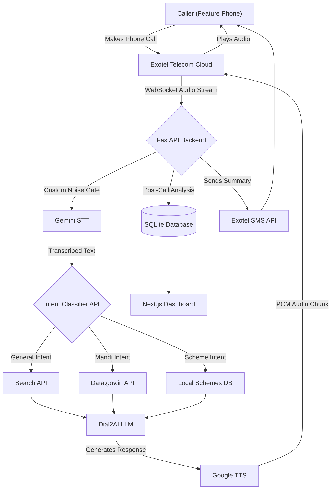

  
  <h1>📞 Dial2AI</h1>
  
<strong>Bridging the digital divide for 350+ Million disconnected Indians using AI over Phone Calls.</strong>

  
<i>No Internet. No Smartphones. Just a Phone Call.</i>

  <h3><a href="YOUR_YOUTUBE_OR_DRIVE_LINK_HERE">▶️ Watch the 3-Minute Live Demo Video Here</a></h3>

---

## 🚀 The Vision & The Problem

While the tech ecosystem races to build the next web app for people with high-speed 5G internet, we are building for the **disconnected**. 

### The Staggering Reality in India (2026):
* 📉 **350+ Million** people still use basic keypad (feature) phones.
* 🚫 **Nearly 50%** of the rural and semi-urban population lacks reliable internet access or digital literacy.
* 🌍 **Millions of citizens**—from farmers and laborers to the elderly—are entirely cut off from the Generative AI revolution, leaving them vulnerable to information asymmetry.

**Dial2AI** integrates state-of-the-art Generative AI directly into legacy telecom networks. A user calls a toll-free number from a simple feature phone, and our system streams their voice via WebSockets to our AI, injecting real-world civic, agricultural, and general data into the conversation seamlessly. 

Built entirely using **Prompt-Driven Development (Vibe Coding)**, this project demonstrates how AI can rapidly accelerate the creation of complex, enterprise-grade architectures to solve real-world social problems.

---

## ⚔️ Competitive Analysis (Why we win)

| Solution | The Problem | How Dial2AI is Better (Our USP) |
|----------|-------------|---------------------------------|
| **WhatsApp Bots / Web Apps** | Require smartphones, 4G internet, and typing literacy. Millions cannot use them. | **Zero Digital Literacy Required:** Works on a $10 Nokia feature phone via a standard GSM voice call. No internet needed. |
| **Traditional IVR Systems** | "Press 1 for Weather, Press 2 for Support." Extremely frustrating, rigid, and limited to hardcoded scripts. | **Natural Conversational AI:** No menus. The user just speaks naturally and the AI understands intent, fetches live data, and replies. |
| **Call Centers (Human)** | Limited operating hours, massive wait times, and impossible to scale to 350M+ users. | **Infinite Scalability & 24/7 Availability:** AI handles thousands of concurrent calls instantly without taking breaks. |
| **Google AI Edge Gallery** | Requires expensive modern smartphones capable of running heavy on-device (Edge) AI models. | **Hardware Agnostic:** Offloads all heavy AI compute to our cloud via telecom infrastructure, making the most advanced AI accessible on the cheapest phones. |
| **Pocket Pal AI / App-based AI** | Requires the user to download an application, navigate a UI, and maintain an internet connection. | **Zero App Downloads:** No installation, no updates, no storage space required. It is as simple as dialing a phone number. |

**Our Ultimate USP:** Dial2AI is the world's first ultra-low-latency, voice-native Generative AI platform that operates purely over traditional telecom protocols (SIP/RTP via WebSockets) while executing dynamic, mid-conversation API routing. 

---

## ✨ Key Features (The Technical Magic)

We engineered Dial2AI to solve real human-computer interaction (HCI) problems over telecom:

1. **🎵 Dynamic Hold Music:** LLMs take 1-2 seconds to generate a response. In telecom, silence feels like a dropped call. To solve this, our WebSocket instantly begins streaming `interval.mp3` (hold music) the moment the caller stops speaking, cutting the music the exact millisecond the AI reply is ready.
2. **🧠 Conversational Memory:** The system maintains a session-based conversation history, allowing the user to ask follow-up questions without repeating context.
3. **🤫 Custom Noise Gating (`contains_speech`):** We wrote a custom amplitude-based filter to ignore telecom line static, preventing the AI from hallucinating background noise.
4. **🚫 Barge-in Interruption:** The AI stops speaking instantly if the user interrupts it, mimicking natural human conversation.
5. **⚡ Dynamic Bitrate Adaptation:** The WebSocket automatically parses SIP headers to adjust between 8000Hz and 16000Hz PCM encoding depending on the carrier connection.
6. **🎯 Live API Injection:** The AI autonomously fetches live data (Mandi prices, Weather, Schemes) mid-conversation to provide 100% accurate answers, completely eliminating LLM hallucinations regarding numbers.
7. **📊 Automated CRM & Lead Extraction:** Our AI post-processes every call to extract the caller's name, intent, and location, dropping them as qualified leads into our Next.js dashboard.
8. **✉️ SMS Follow-Up:** A personalized SMS summary of the conversation is sent to the user the moment they hang up.

---

## 🚧 Challenges We Ran Into (And How We Solved Them)

Building high-speed Generative AI over legacy telecom networks is incredibly difficult. Here is how we engineered our way out of the hardest HCI and networking problems:
* **The "Telecom Static" Problem:** Exotel's WebSocket audio format is raw 16-bit PCM. The line always has background static, which the Gemini STT interpreted as endless whispering (hallucinations). **Solution:** We vibe-coded a custom mathematical amplitude gate (`get_avg_amplitude`) to dynamically filter out frequencies below a certain decibel threshold before sending it to the STT engine.
* **The "Dead Air" Drop-off:** Callers would hang up while waiting for the LLM API to respond because silence on a phone implies a dropped call. **Solution:** We engineered an asynchronous background task that streams an `interval.mp3` directly into the socket buffer the exact millisecond the user stops talking, keeping them engaged.
* **The "Echo Barge-in" Challenge:** When streaming bidirectional audio, the STT often transcribed the *AI's own echo* coming through the phone speaker as the user's speech. **Solution:** We implemented a strict state machine (`playback_start_time`) and calculated exact echo-guard windows to ensure the AI only interrupts itself for real human barge-ins, not its own TTS audio.
* **The "Async Audio Buffering" Challenge:** Telecom websockets stream bytes endlessly, but LLMs need complete sentences to understand context. **Solution:** We built an intelligent asynchronous bytearray buffer that uses natural silence detection (2-second gaps) to trigger the STT engine without blocking the active WebSocket stream.

---

## 💰 Business Model & Scalability

Dial2AI is not just a hackathon project; it is designed to be a financially sustainable, highly scalable enterprise platform:
1. **B2G (Business to Government):** Licensing the platform as a white-labeled API to Government helplines (like health/agriculture) to replace their overwhelmed human call centers.
2. **B2B (Enterprise Automation):** Providing our voice API to logistics, rural tech startups, and FMCG companies, charging a per-minute latency fee to automate their customer support lines.

## 🗺️ What's Next (The Roadmap)

Our foundation is built. Here is how we scale to millions of users:
* **Toll-Free "Missed Call" Architecture:** Currently, users call a standard Exotel number which may incur carrier charges. In the future, we will implement a true "Missed Call" flow: the system instantly disconnects the incoming call (costing the user ₹0) and automatically triggers an outbound callback to begin the AI session.
* **Auto-Location Detection:** Integrating telecom network APIs to securely auto-detect the caller's district, allowing the AI to personalize weather, news, or civic data without asking for their location.
* **Bi-Directional SMS Querying:** We currently send an automated post-call summary SMS, but we are building an inbound SMS parser. Users with low 2G network bars can simply text a query to the same number and receive an AI-generated SMS instantly without even needing to call.
* **Expanding the API Ecosystem:** Integrating deeper into hyper-local APIs (Banks, IMD, Medical Databases) to provide even faster, more precise, and hyper-personalized advice.

---

## 🔄 The User Workflow

```mermaid
sequenceDiagram
    autonumber
    participant User
    participant Exotel
    participant Dial2AI
    participant APIs

    User->>Exotel: Dials number
    activate Exotel
    Exotel->>Dial2AI: Opens audio stream
    activate Dial2AI
    Dial2AI->>User: "Namaste! How can I help?"
    
    User->>Dial2AI: Asks question
    
    rect rgb(30, 40, 60)
    Note right of Dial2AI: ⚡ AI Processing Phase
    Dial2AI-->>Exotel: 🎵 Plays hold music
    Dial2AI->>APIs: Fetches live data
    activate APIs
    APIs-->>Dial2AI: Returns data
    deactivate APIs
    end

    Dial2AI->>User: 🗣️ Speaks AI response
    User->>Exotel: Hangs up call
    deactivate Exotel
    
    rect rgb(40, 30, 50)
    Note over Dial2AI: 📊 Post-Call Actions
    Dial2AI-->>Dial2AI: Logs to dashboard
    Dial2AI-->>User: ✉️ Sends SMS summary
    deactivate Dial2AI
    end
```

---

## 🏗️ Architecture

## 🛠️ Tech Stack & Libraries
* **AI/LLMs:** Google Gemini 2.5 Flash (STT), Gemini 3.5 Flash (Reasoning & Analytics), `google-genai` SDK, Google TTS (`gTTS`).
* **Backend:** Python 3.12, `FastAPI` (Async API), `websockets` (Real-time audio), `uvicorn` (ASGI Server), `httpx` (Async HTTP), `pydantic`, `sqlite3` (Database), `FFmpeg` (Audio processing).
* **Telephony:** Exotel (Passthru Applets, SMS API).
* **Frontend Dashboard:** `Next.js 14`, `React`, `TailwindCSS` (Styling), `Recharts` (Analytics Charts), `Lucide-React` (Icons).

---

  <i>Built with ❤️ by Team Git Push Pray for HackIndia 2026.</i> 
  <i>Licensed under the MIT License.</i>

