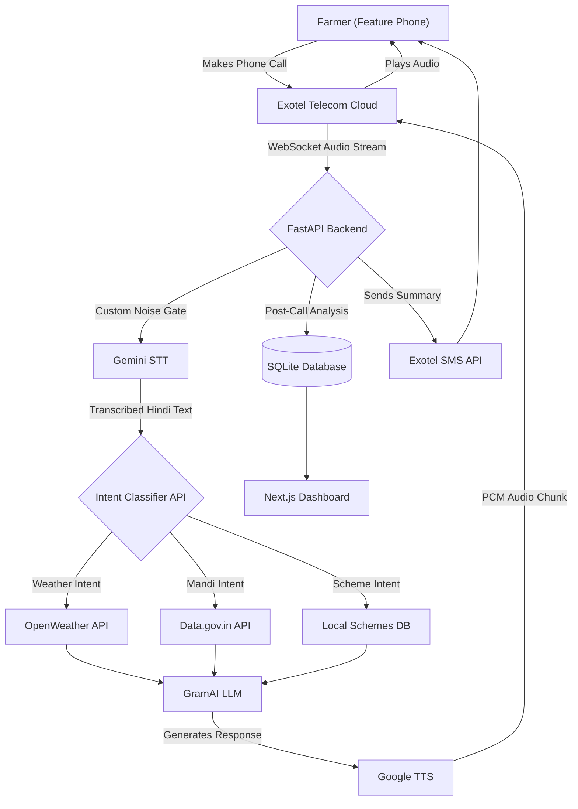

  
  <h1>🌾 GramAI (Missed Call AI)</h1>
  
<strong>Bridging the digital divide for 150 Million Indian Farmers using AI over Phone Calls.</strong>

  
<i>No Internet. No Smartphones. Just a Phone Call.</i>

---

## 🚀 The Vision

While the world builds web apps for people with high-speed internet, we built an AI agent for the **disconnected**. 
GramAI integrates state-of-the-art Generative AI directly into legacy telecom networks. A farmer calls a toll-free number from a simple feature phone, and our system streams their voice via WebSockets to our AI, injecting real-world agricultural data into the conversation seamlessly. 

Built entirely using **Prompt-Driven Development (Vibe Coding)**, this project demonstrates how AI can rapidly accelerate the creation of complex, enterprise-grade architectures to solve real-world social problems.

## ✨ Key Features

We engineered GramAI to solve real human-computer interaction (HCI) problems over telecom:

1. **🎵 Dynamic Hold Music (Zero Dead Air):** LLMs take 1-2 seconds to generate a response. In telecom, silence feels like a dropped call. To solve this, our WebSocket instantly begins streaming `interval.mp3` (hold music) the moment the caller stops speaking, cutting the music the exact millisecond the AI reply is ready.
2. **🧠 Conversational Memory:** The system maintains a session-based conversation history, allowing the farmer to ask follow-up questions without repeating context.
3. **🤫 Custom Noise Gating (`contains_speech`):** We wrote a custom amplitude-based filter to ignore telecom line static, preventing the AI from hallucinating background noise.
4. **🚫 Barge-in Interruption:** The AI stops speaking instantly if the user interrupts it, mimicking natural human conversation.
5. **⚡ Dynamic Bitrate Adaptation:** The WebSocket automatically parses SIP headers to adjust between 8000Hz and 16000Hz PCM encoding depending on the carrier connection.
6. **🎯 Live API Injection:** The AI autonomously fetches live data (Mandi prices, Weather) mid-conversation to provide 100% accurate answers, completely eliminating LLM hallucinations regarding numbers.
7. **📊 Automated CRM & Lead Extraction:** Our AI post-processes every call to extract the caller's name, intent, and location, dropping them as qualified leads into our Next.js dashboard.
8. **✉️ SMS Follow-Up:** A personalized SMS summary of the conversation is sent to the user the moment they hang up.

---

## 🏗️ Architecture

We built a highly scalable, async event-driven architecture using Python FastAPI, Next.js, and WebSockets.

## 🛠️ Tech Stack
* **AI/LLMs:** Google Gemini 2.5 Flash (STT), Gemini 3.5 Flash (Reasoning & Analytics), Google TTS.
* **Backend:** Python, FastAPI, WebSockets, SQLite, FFmpeg.
* **Telephony:** Exotel (Passthru Applets, SMS API).
* **Frontend Dashboard:** Next.js, React, TailwindCSS, Recharts.

---

  <i>Built with ❤️ by Team Git Push Pray for HackIndia 2026.</i>

